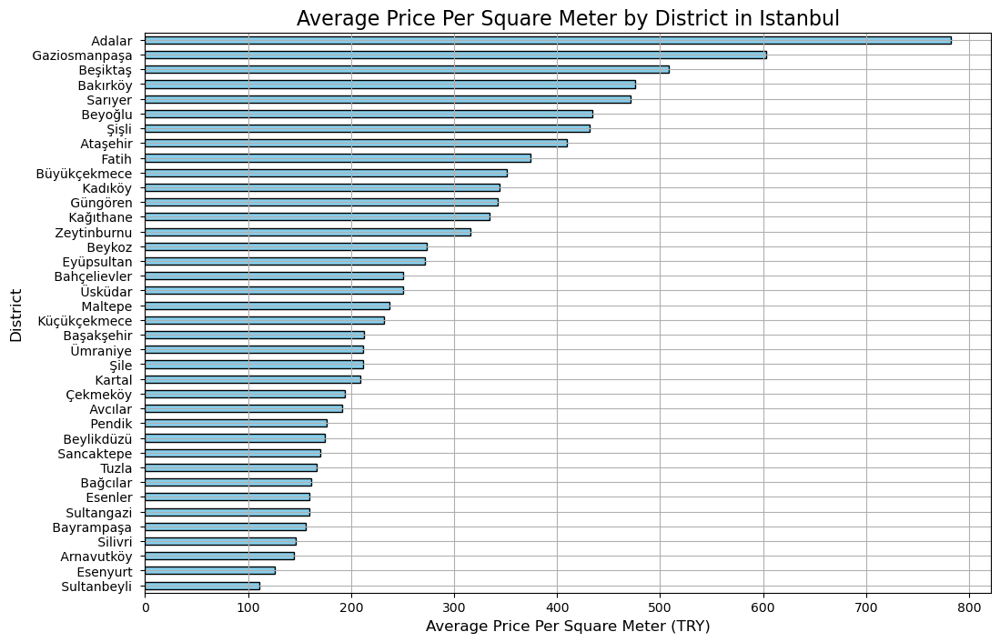
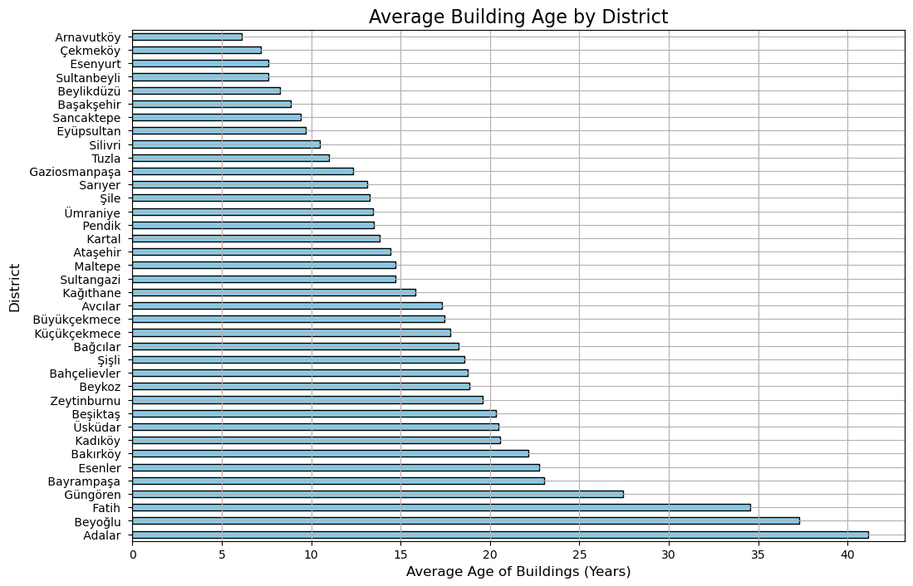
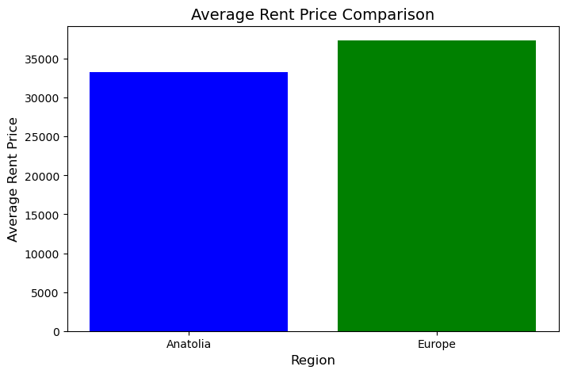
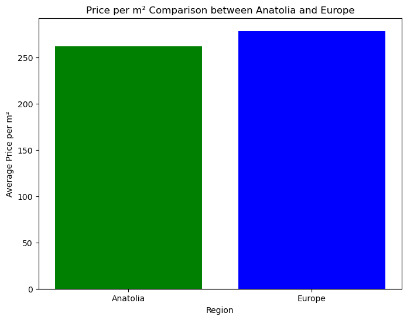

# Istanbul Rental Apartments Analysis

## Project Overview
This project analyzes the **Istanbul Rental Apartments Dataset (2025)**, which includes rental apartment listings from Istanbul, Turkey. The dataset contains detailed information about rental properties, such as the district, neighborhood, number of rooms, apartment size in square meters, building age, floor number, and rental price in Turkish Lira (TRY).

## Data Overview
The dataset contains the following columns:

- **district**: The district (e.g., Beşiktaş, Kadıköy)
- **neighborhood**: The neighborhood name
- **room**: Number of rooms
- **living_room**: Number of living rooms
- **area_m2**: Apartment size in square meters (m²)
- **age**: Age of the building
- **floor**: Floor number (Negative values indicate basement floors)
- **price**: Rental price in Turkish Lira (TRY)

## Dataset Information
This dataset is provided by **Samet Şentürken** and uploaded on Kaggle. The original dataset is licensed under **CC BY-SA 4.0**.

You can access the dataset on Kaggle [here](https://www.kaggle.com/datasets/sametsenturken/istanbul-apartment-for-rent).

## Project Description
This analysis aims to:
- Explore rental price trends across various districts and neighborhoods.
- Investigate the relationship between apartment size, number of rooms, and price.
- Visualize rental price distributions and correlations using various graphs.
- Provide insights for potential renters or real estate investors in Istanbul.

## License
This project is licensed under the [MIT License](https://opensource.org/licenses/MIT).

The dataset used in this project is sourced from **Samet Şentürken's "Istanbul Rental Apartments Dataset (2025)"** on Kaggle and is originally licensed under **CC BY-SA 4.0**.  
The dataset's original license details can be found [here](https://creativecommons.org/licenses/by-sa/4.0/).

## How to Use

1. Clone this repository to your local machine.
2. Install the required libraries by running the following command:
    ```bash
    pip install -r requirements.txt
    ```
3. Download the dataset from [Kaggle](https://www.kaggle.com/datasets/samet-senturken/istanbul-rental-apartments-dataset-2025) and place it in the `data` folder.
4. Make sure the dataset file is named `istanbul_rental_apartments.csv` and is located in the `data` folder.
5. Open and run the Jupyter notebooks or Python scripts to see the analysis and visualizations.

# 🧑‍💼 Analysis Results: Istanbul Rental Market

Here is the detailed analysis and corresponding visualizations on various aspects of the rental market in Istanbul.

---

## 1️⃣ Highest Average Rental Prices by District

In this analysis, we explored the districts with the highest average rental prices in Istanbul. Beşiktaş, Adalar, and Sarıyer emerged as the top three districts with the highest rental prices.


---

## 2️⃣ Impact of Floor Level on Rental Prices

We observed a direct correlation between floor level and rental prices. Higher-floor apartments typically demand higher rents, with ground-floor apartments also showing significant prices due to their location and amenities.


---

## 3️⃣ Price Per Square Meter: Most Expensive Districts

This analysis reveals that Adalar ranks the highest in price per square meter, followed by Beşiktaş and Sarıyer. Despite Adalar's smaller apartment sizes, its rental prices are substantially higher per square meter.



---

## 4️⃣ Building Age and Structural Risks

Adalar and Beyoğlu have the oldest buildings on average, reflecting their historical significance. However, older buildings come with the potential risk of structural issues, especially regarding earthquake resilience.



---

## 5️⃣ European vs. Asian Side: A Market Comparison

A comprehensive comparison between the European and Asian sides of Istanbul shows a marked difference in rental prices, building ages, and price per square meter, with the European side leading in all categories.






---

