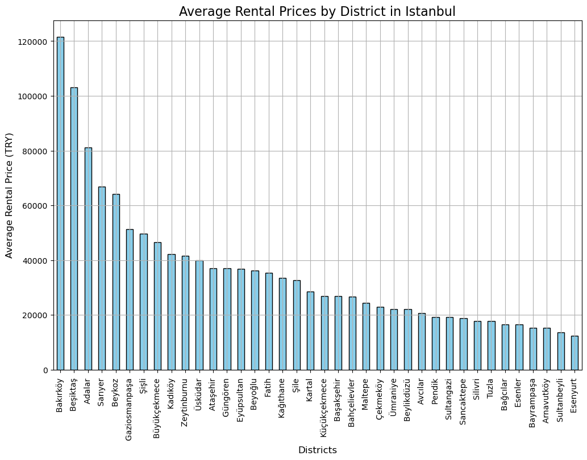
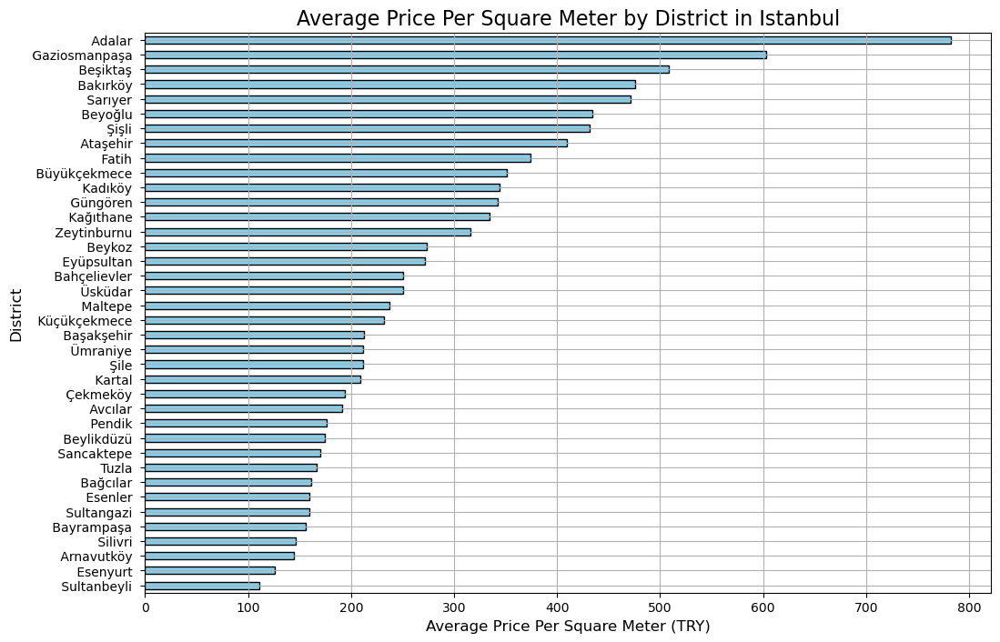
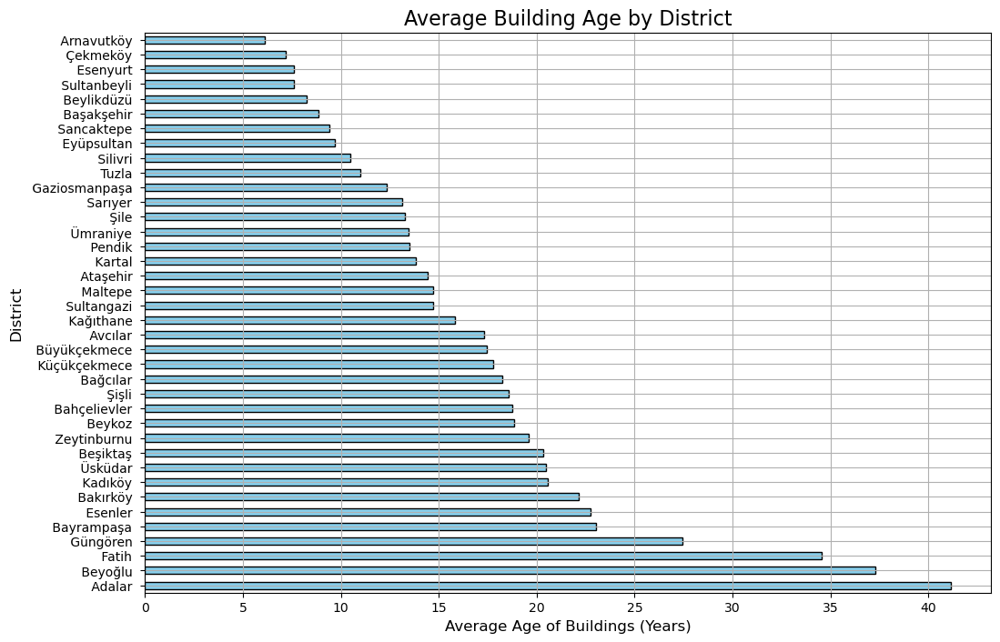
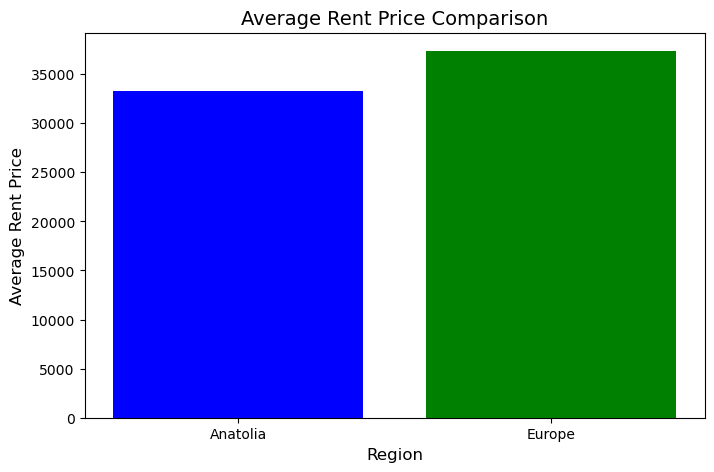
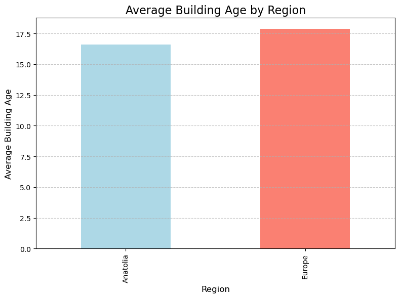
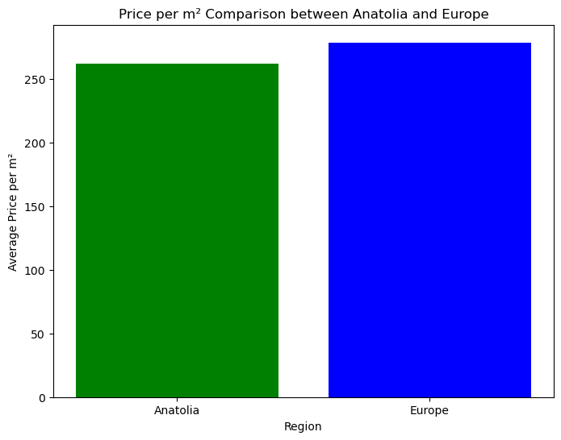

# 🧑‍💼 Analysis Results: Istanbul Rental Market

In this file, you will find detailed analysis and corresponding visualizations on various aspects of the rental market in Istanbul.

---

## 1️⃣ Highest Average Rental Prices by District

In this analysis, we explored the districts with the highest average rental prices in Istanbul. Beşiktaş, Adalar, and Sarıyer emerged as the top three districts with the highest rental prices.

---

## 2️⃣ Impact of Floor Level on Rental Prices

We observed a direct correlation between floor level and rental prices. Higher-floor apartments typically demand higher rents, with ground-floor apartments also showing significant prices due to their location and amenities.

---

## 3️⃣ Price Per Square Meter: Most Expensive Districts

This analysis reveals that Adalar ranks the highest in price per square meter, followed by Beşiktaş and Sarıyer. Despite Adalar's smaller apartment sizes, its rental prices are substantially higher per square meter.

---

## 4️⃣ Building Age and Structural Risks

Adalar and Beyoğlu have the oldest buildings on average, reflecting their historical significance. However, older buildings come with the potential risk of structural issues, especially regarding earthquake resilience.

---

## 5️⃣ European vs. Asian Side: A Market Comparison

A comprehensive comparison between the European and Asian sides of Istanbul shows a marked difference in rental prices, building ages, and price per square meter, with the European side leading in all categories.

---
